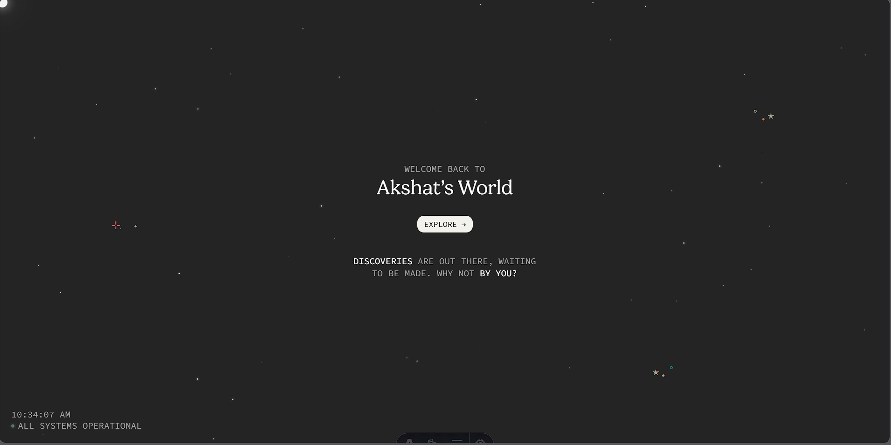

<p align="center">
  <a href="https://milliondreams.vercel.app">
    
  </a>
</p>

# PortfolioV2 — Akshat Darshi

Personal portfolio for **[Akshat Darshi](https://milliondreams.vercel.app)** — software engineer building production SaaS, agentic GenAI, and Voice AI systems. Backend-heavy full-stack across Next.js, Go, Spring Boot, and AWS. Currently @ Tracks & Towers Infratech.

## What's here

- **8 case studies** written as engineer's technical blogs — Bawarchie, RoboRumble 3.0, Talk2PDF, EvolveSanga, ResumeAI, RBAC Auth, EHM Platform, Misinformation Agent
- **Visitor card system** — sign in, pick a color, draw a signature, find your card in the gallery (backed by Cloudflare D1)
- **Animated welcome scene** — starfield, shooting stars, sunrise transition into the home page
- **Engineer-blog template** — shared `csb-*` styles, themed via `data-theme="pink|teal|green|orange"`, scrollspy TOC, ASCII architecture diagrams, tradeoff cards, results tiles
- **SEO-optimized** — unique title + description per page, JSON-LD Person schema, OpenGraph + Twitter cards
- **Motion-safe** — every animation respects `prefers-reduced-motion`

## Tech Stack

- **[Astro 5](https://astro.build/)** — SSR, file-based routing, View Transitions
- **[Cloudflare Workers + D1](https://developers.cloudflare.com/workers/)** — edge runtime + SQLite at the edge
- **[Tailwind CSS v4](https://tailwindcss.com/)** via the Vite plugin
- **[GSAP](https://gsap.com/)** — animation
- **TypeScript** end-to-end
- **pnpm** as the package manager

## Quick Start

```bash
pnpm install
pnpm dev
```

The dev server runs on `http://localhost:4321` with Miniflare giving you a real D1 binding locally — no mocking required.

Other scripts:

```bash
pnpm build      # Build for Cloudflare Workers (output: dist/_worker.js + assets)
pnpm preview    # Preview the production build locally
pnpm check      # TypeScript + Astro type checking
```

## Project Structure

```
src/
├── components/    # 35+ components organized by feature
│   ├── home/      # starfield, project cards, hero
│   ├── about/     # community cards, favorites shelf, stickers
│   ├── gallery/   # visitor gallery
│   ├── onboarding/# visitor onboarding flow
│   ├── scenery/   # shooting stars, spark bursts, particles
│   └── ui/        # shared primitives (Button, Tag, Field…)
├── layouts/       # base page layout
├── lib/           # visitor tracking, utilities
├── pages/         # file-based routes + API endpoints
│   └── work/      # 8 case studies + Megan's reference pages
└── styles/        # design tokens (colors, type, spacing, motion)
```

Top-level supporting files:

```
astro.config.mjs   # Astro config — adapter, redirects, vite tweaks
wrangler.toml      # Cloudflare Workers config — D1 binding, worker entry
migrations/        # D1 schema migrations (0001_visitors → 0004_counters)
public/            # static assets — images, fonts, og.png, robots.txt
```

## Architecture in one paragraph

Astro renders each page on the server inside a Cloudflare Worker (V8 isolate, ~5ms cold start at 300+ edge locations). Visitor data lives in **D1** — Cloudflare's serverless SQLite — bound to the worker as `env.DB`. There's no long-running server, no connection pool to manage, and no scaling concerns: each request spins up a Worker, queries D1, returns HTML, and the isolate goes away. The whole site fits a single bundle deployed via `wrangler deploy`.

## Deployment

Deployment lives in [`DEPLOY.md`](./DEPLOY.md). The short version:

```bash
pnpm build
pnpm exec wrangler deploy
pnpm exec wrangler d1 migrations apply portfolio   # apply schema changes
```

## SEO

Out of the box, the site ships with:

- Unique `<title>` and `<meta description>` per page
- Canonical URLs
- OpenGraph profile tags + Twitter `summary_large_image`
- JSON-LD `Person` schema (feeds Google's knowledge panel)
- `robots.txt` pointing at the sitemap
- `sitemap.xml.ts` enumerating every public route

The `og.png` (1200×630) is the share-card preview that unfurls on Slack, LinkedIn, Twitter, etc.

## Credits

This portfolio is built on a structure originally created by **[Megan Yap](https://meganyap.me)** ([github.com/megany128/portfolio](https://github.com/megany128/portfolio)) — the visitor card system, animation primitives, and design tokens are adapted from her excellent work. The 8 engineer-blog case studies, the project content, and the personal sections are mine.

## License

MIT — see [LICENSE](./LICENSE) if present, otherwise treat as personal/unlicensed for now.
